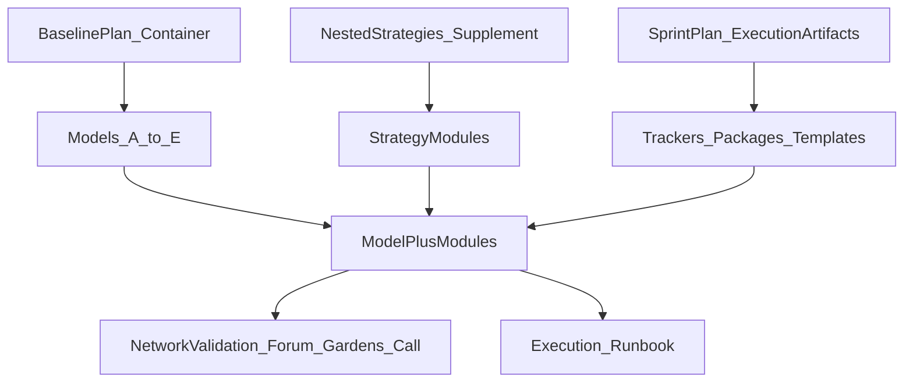
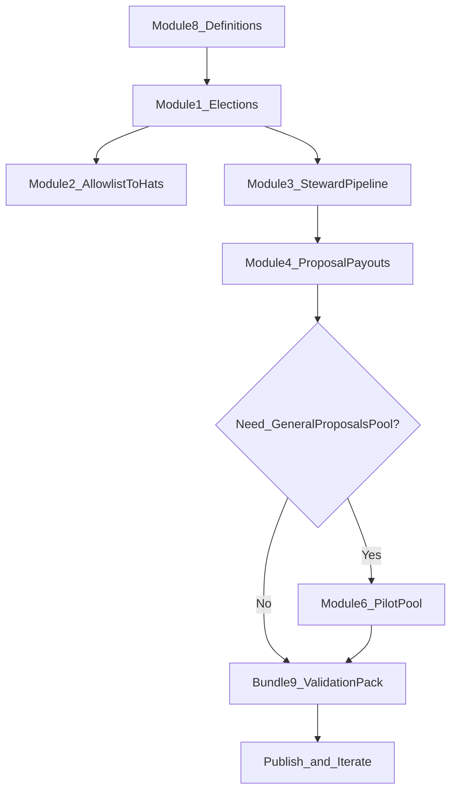

## ReFi DAO 3.0 — Master Plan Summary (3-plan consolidation)

**Focus:** Different + nested (composable) strategies

### What this document does

This consolidates three planning layers into a single, legible map:

- the **baseline container** (the consolidated ReFi DAO 3.0 docs),
- the **execution sprint** (missing actionable artifacts), and
- the **nested strategy modules** (governance + ops mechanisms that can nest inside any model).

For the nested strategies supplement, also see: [Supplemental Plan](supplemental-plan-from-transcripts.md).

---

## Section A — Strategy landscape (nested + composable strategies)

### Models vs modules

- **Strategic models (A–E)**: directional options for ReFi DAO 3.0 (growth/sustainability focus, where autonomy sits, platform dependence).
- **Strategy modules**: reusable mechanisms and operating patterns that can be **nested inside** any model.

The recordings emphasize that ReFi DAO 3.0 should be understood as a **bundle of composable strategies**, and that part of the job is to make the “good pairings” explicit.

### The 3 plans as a coherent stack

- **Baseline plan**: builds the **container** (the 5-model framework + consolidated docs).
- **Sprint plan**: adds **execution artifacts** (trackers/templates/presentation package).
- **Nested strategies supplement**: adds **governance/ops mechanisms** (elections, payout workflows, integration pathways) that can attach to any model.

---

## Section B — Strategy modules catalog (with provenance + decision gates)

Each module is described as **What / Why / How / Dependencies / Risks / Decision gate / Sources**.

### Module 1 — Gardens-based role validation / elections

- **What**: Use Gardens signaling/election mechanisms to validate roles.
- **Why**: Increase legitimacy and reduce closed “gatekeeping.”
- **How**: Pilot one role category with a defined electorate and fixed window.
- **Dependencies**: role definitions, electorate definition, comms, pool admin.
- **Risks**: low turnout, capture dynamics, slowed decisions.
- **Decision gate**: expand only if pilot participation and legitimacy are acceptable.
- **Sources**: nested strategies supplement + baseline validation requirements.

### Module 2 — Allowlists → Hats minting (Guild.xyz optional)

- **What**: Convert Gardens outcomes into an allowlist, then mint Hats to that allowlist.
- **Why**: Make governance outcomes enforceable in the role/access layer.
- **How**: One-cycle allowlist export → Hats mint; document steps.
- **Dependencies**: Hats admin permissions; safe operational handling.
- **Risks**: operational errors; unclear rollback.
- **Decision gate**: remove Guild.xyz only after access-control parity is confirmed.
- **Sources**: nested strategies supplement.

### Module 3 — Core Stewards election pipeline (Global → subset)

- **What**: Re-activate Core Stewards via an election pipeline: elect Global contributors/advisors, then elect a subset as Core Stewards.
- **Why**: Restore a functioning governance layer with network legitimacy.
- **How**: Two-step elections with clear cap + term.
- **Dependencies**: mandate definitions; electorate; comms.
- **Risks**: legitimacy disputes if rushed; unclear authority.
- **Decision gate**: only proceed to steward election after the Global election is stable.
- **Sources**: nested strategies supplement.

### Module 4 — Proposal-based payouts + cost “slim-down”

- **What**: Reduce baseline retainers; route extra work through proposals and payouts (Safe-first or hybrid with Gardens).
- **Why**: Align spend to deliverables in low-grant conditions; improve transparency.
- **How**: One-month pilot with a proposal template + approval SLA + public ledger.
- **Dependencies**: template; approval authority; reporting format.
- **Risks**: slower execution; contributor fatigue.
- **Decision gate**: continue only if cycle time and clarity improve.
- **Sources**: nested strategies supplement.

### Module 5 — Cookie Jar (optional treasury delegation pattern)

- **What**: Explore bounded disbursement powers for a role.
- **Why**: Reduce bottlenecks while keeping spend bounded.
- **How**: Evaluate feasibility; pilot only after Module 4 stabilizes.
- **Dependencies**: Safe tooling; bounds; monitoring.
- **Risks**: delegation risk; complexity.
- **Decision gate**: adopt only with clear monitoring + revocation.
- **Sources**: nested strategies supplement.

### Module 6 — “General Proposals” Gardens pool (decision-gated)

- **What**: Add a Gardens pool for general proposals beyond Local Nodes + Network Initiatives.
- **Why**: Standardize intake/prioritization for network-wide work.
- **How**: Pilot with 1–3 proposals and strict scope boundaries.
- **Dependencies**: pool setup; eligibility rules; moderation.
- **Risks**: scope creep; low-signal proposals.
- **Decision gate**: create pool only if Safe-first proposal workflow cannot prioritize effectively.
- **Sources**: nested strategies supplement.

### Module 7 — Green Pill Network integration pathway (phased, decision-gated)

- **What**: Explore phased deeper integration/merge pathway with Green Pill Network.
- **Why**: Shared domain and limited ops capacity suggests leverage by combining forces.
- **How**: Phase 0 discovery memo → Phase 1 experiments → Phase 2 governance/brand decision.
- **Dependencies**: stakeholder alignment; scope boundaries.
- **Risks**: high political surface area; derailing closure work.
- **Decision gate**: proceed only if Phase 0/1 gates are met.
- **Sources**: nested strategies supplement.

### Module 8 — Legibility module: definitions cohesion (Network Members + Contribution Points)

- **What**: One-page glossary + decision tree clarifying roles and what Contribution Points do/don’t affect.
- **Why**: Reduce ambiguity and align onboarding/elections/governance.
- **How**: publish glossary + decision tree; reference it across docs.
- **Dependencies**: reconcile legacy definitions.
- **Risks**: stakeholder disagreement.
- **Decision gate**: none—treat as required hygiene before elections.
- **Sources**: nested strategies supplement.

### Module bundle 9 — Network validation packaging (forum + Gardens + call)

- **What**: Ship materials that let the network validate and pick model(s)/modules.
- **Why**: Baseline plan requires network validation; sprint plan notes materials are missing.
- **How**: forum post draft + Gardens proposal draft + call agenda + “decision questions”.
- **Dependencies**: consolidated model summary; decision criteria.
- **Risks**: low engagement if too long; confusion if modules aren’t framed.
- **Decision gate**: none—enabling mechanism for selection.
- **Sources**: baseline plan + sprint plan.

---

## Section C — Nesting views (both, compact)

### C1 — Layer map

| Layer | Modules that primarily live here | Key couplings |
|---|---|---|
| Membership/Roles | Module 8 | Definitions → electorate clarity for elections |
| Governance | Module 1, Module 3 | Elections → legitimacy; steward pipeline depends on election machinery |
| Governance tooling | Module 2 | Elections → allowlists → Hats minting |
| Treasury/Ops | Module 4 (+ Module 5 optional) | Proposal workflow ↔ approval authority; Cookie Jar only after stability |
| Initiatives | Module 6 (gated) | Proposal intake can route work into initiatives |
| Partnerships | Module 7 (gated) | Do not expand until governance/ops basics are stable |
| Network validation | Bundle 9 | Must reflect both models and modules |

### C2 — Models A–E × Strategy modules compatibility matrix

Legend: **C** = core fit, **O** = optional fit, **R** = risk/conflict to manage.

| Strategy module | Model_A_HighGrowth | Model_B_Balanced | Model_C_InitiativeLed | Model_D_NodeCentric | Model_E_Adaptive |
|---|---:|---:|---:|---:|---:|
| Module 1: Gardens elections | O | C | C | C | C |
| Module 2: Allowlists→Hats | O | C | C | C | C |
| Module 3: Core Stewards pipeline | O | C | O | O | C |
| Module 4: Proposal-based payouts | O | C | C | C | C |
| Module 5: Cookie Jar (optional) | R | O | O | O | O |
| Module 6: General Proposals pool | R | O | C | O | C |
| Module 7: Green Pill pathway | R | O | O | O | C |
| Module 8: Definitions cohesion | C | C | C | C | C |
| Bundle 9: Validation packaging | C | C | C | C | C |

### C3 — Example bundles (nested stacks)

1) **Legitimacy-first governance stack**
- Module 8 → Module 1 → Module 2 → Module 3

2) **Lean ops sustainability stack**
- Module 4 (+ Module 5 only after stability)

3) **Network validation launch stack**
- Bundle 9 + “module menu” excerpt from Section B

4) **Integration discovery stack (gated)**
- Module 7 Phase 0 only + explicit decision gates

---

## Section D — Execution reality (deliverables/status table)

This reflects the current contents of `docs/refi-dao-3.0/`.

| Deliverable | Origin plan | Target path | Status | Notes |
|---|---|---|---|---|
| Core docs set + archive | Baseline | `./` + `./archive/` | Exists | Present in this directory |
| Nested strategies supplement | Supplement | `./supplemental-plan-from-transcripts.md` | Exists | Adds module-level deltas |
| Closure execution tracker | Sprint | `./closure-execution-tracker.md` | Missing | Not present |
| Network presentation package | Sprint | `./network-presentation/` | Missing | Not present |
| Financial activation plan | Sprint | `./financial-activation-plan.md` | Missing | Not present |
| Initiatives launch kit | Sprint | `./initiatives-launch-kit.md` | Missing | Not present |
| Infra migration execution plan | Sprint | `./infrastructure-migration-execution.md` | Missing | Not present |
| Executive summary | Sprint | `./executive-summary.md` | Missing | Not present |

---

## Section E — Unified runbook (pilot-first sequence, next 2–4 weeks)

### Week 0
- Publish Module 8 (definitions cohesion)
- Choose pilot role category for Module 1
- Draft Bundle 9 with a clear “module menu”

### Week 1
- Run Module 1 pilot election
- Execute Module 2 allowlist→Hats for the pilot
- Start Module 4 proposal-based payouts pilot

### Week 2
- If stable: progress toward Module 3 steward pipeline
- Decide on Module 6 (General Proposals pool) via decision gate

### Weeks 3–4
- Publish Bundle 9 for network validation (models + modules)
- If governance bandwidth exists: Module 7 Phase 0 discovery memo (strictly gated)

---

## Section F — Appendices

### Canonical baseline docs in this directory

- [README](README.md)
- [Current State](current-state.md)
- [Closure Checklist](closure-checklist.md)
- [Vision & Strategic Models](vision-strategic-models.md)
- [Documentation Structure](documentation-structure.md)
- [Implementation Plan](implementation-plan.md)

### Terminology normalization note

Use consistent naming across artifacts (roles, membership levels, and governance bodies). When legacy naming differs across documents, normalize terms in summaries and keep pointers back to canonical definitions.

